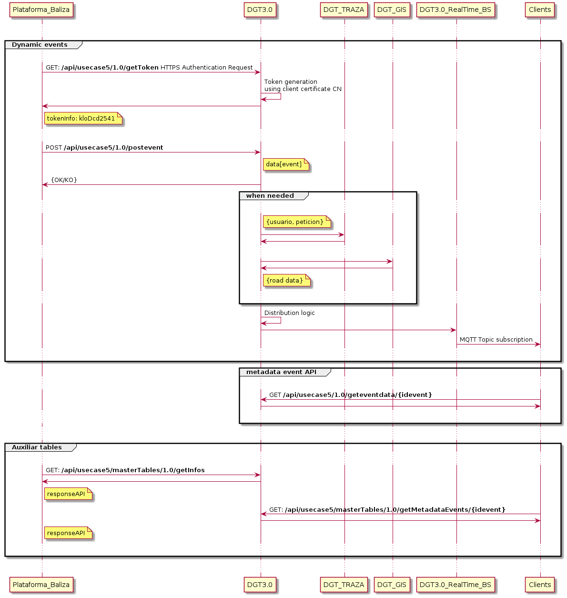

# Caso de uso 5 de la plataforma DGT3.0 Envío dinámico de coordenadas X,Y por las especiales condiciones de circulación de un vehículo

El presente documento se elabora con el objetivo de servir de ayuda a la integración para clientes del caso de uso.

## Actores

* Plataforma de balizas cliente: Plataforma que conecta como cliente a DGT3.0 enviando eventos proporcionados por los dispositivos
* DGT3.0: Parte de la plataforma de DGT3.0 que recibe los eventos desde la plaraforma de balizas cliente
* DGT Traza: Aplicación TRAZA de DGT para enriquecimiento de datos
* DGT3.0_RealTime_BS: Parte de la plataforma DGT3.0 que publica los eventos una vez procesados 
* Plataforma consumidora cliente: Plataforma que conecta a DGT3.0 para obtener información generada

## Flujo de información
Dada las características del caso de uso, se diferencian dos partes en el mismo. La ingesta de datos procedentes de las plataformas de balizas y la publicación de estos datos. El flujo de menesajes se puede mostrar en el siguiente gráfico.

Se ha descrito cada uno de estos interfaces por separado para facilitar su comprensión
* [Ingesta de datos](caso5_in.md)
* [Publicación de datos](caso5_out.md)