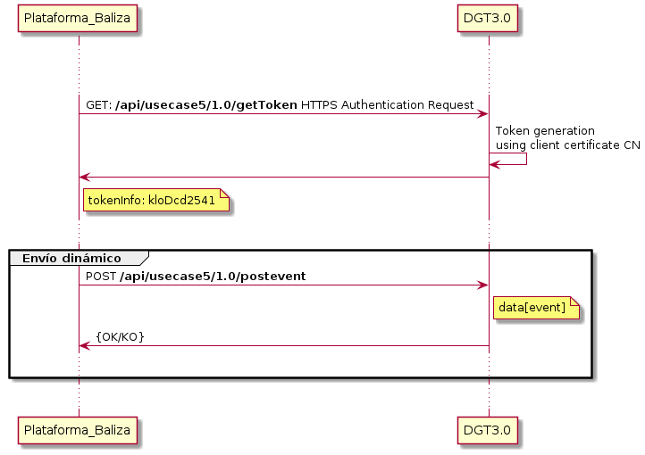

# Ingesta de datos

El objeto de este interfaz es recibir los eventos proporcionados por los vehículos, a través de sus clouds correspondientes.

Para la conexión del Cloud es necesario ponerse en contacto con los responsables de la plataforma y solicitar el correspondiente Certificado Digital de cliente con el que se autenticarán frente a la plataforma.

## Contacto de Soporte

Para solventar cualquier duda o incidencia se ha abierto un buzón de correo en el que se atenderán estas

soporte@cmobility30.es

## Conectividad

Entorno | URL
|:-:|:-:
PRE | 
PRO |

## Flujo de conexión




## Documentación del API

La documentación completa del API se encuentra disponible en la URL https://app.swaggerhub.com/apis-docs/jgcasta/DGT3.0_caso5/1.0.0 Esta documentación se encuentra en formato SWAGGER para facilitar su uso.

A continuación se muestra un ejemplo de datos a enviar
```json
	
{
  "token": "5e1f9b576ec525aa0519c0c0c9f04907aacf7bb13a38c37796bb1b1756aea116",
  "idcompany": "v2client.acme.com",
  "action_id": "CLI_235",
  "dgt_id": "DGT_235",
  "dgt_security_id": "alskd:44235",
  "beacon_id": "cff92179-dc0a-47da-bd9e-5e9c5b14d251",
  "beacon_type": 0,
  "ts": "2020-01-29T09:12:331Z",
  "lon": -3.45368,
  "lat": 40.36586,
  "vehicle_type": 1,
  "event": 0,
  "information_quality": 1,
  "device_type": 0,
  "speed": 40.3
}
```

## Proceso de autenticación

El proceso de autenticación requiere el uso del correspondiente certificado de cliente. 