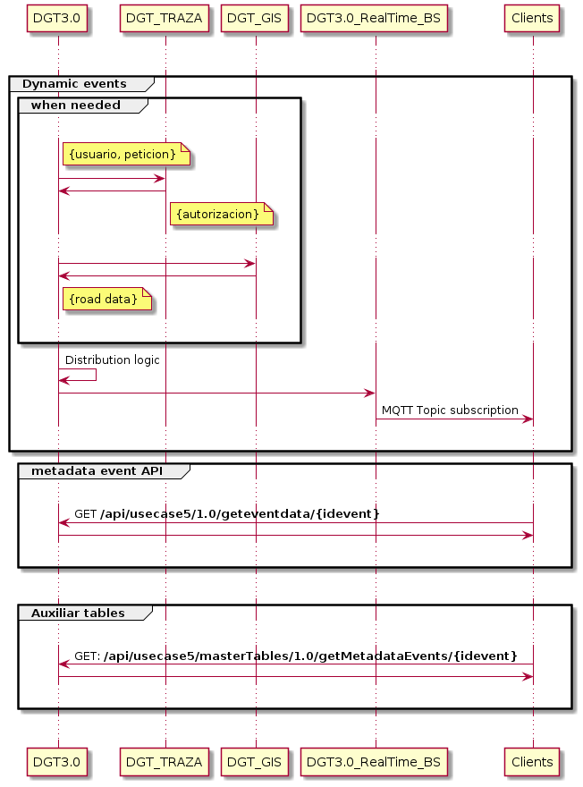

# Publicación de datos

El objeto de este servicio es la publicación de datos recibidos desde los dispositivos y de la información asociada a los mismos. Para ello se expondrán dos interfaces
* Publicación en tiempo real de la posición de los eventos
* Publicación de datos asociados a cada evento

Para la conexión del Cloud es necesario ponerse en contacto con los responsables de la plataforma y solicitar el correspondiente Certificado Digital de cliente con el que se autenticarán frente a la plataforma.

## Contacto de Soporte

Para solventar cualquier duda o incidencia se ha abierto un buzón de correo en el que se atenderán estas

soporte@cmobility30.es

## Conectividad

Entorno | URL
|:-:|:-:
PRE | 
PRO |

## Flujo de conexión

## Publicación en tiempo real de eventos

Dada la criticidad de los eventos, se publicarán a través de un broker MQTT la información dinámica de los eventos. Los clientes se suscribirán al broker recibiendo la mensajería de acuerdo al API descrito en 

## Publicación de datos asociados a cada evento

A través de un microservicio se expondrá un API REST para permitir la consulta de los metadatos asociados a un evento.

## Documentación del API

## Proceso de autenticación

El proceso de autenticación requiere el uso del correspondiente certificado de cliente. 